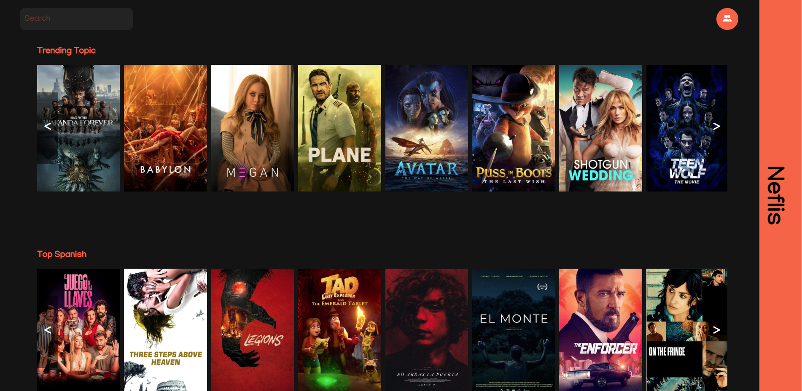

`#html`  `#css`  `#js`  `#php`  `#master-in-software-development`

# Neflis

_Neflis es una pagina para ver información sobre películas, crear tus listas y votar tus películas favoritas_




### Pre-requisitos 📋

_Necesitas instalar Xampp y una base de datos mysql para poder ejecutar la aplicación web._

### Instalación 🔧

_Comando para instalar los modulos usados como Sass_

```
npm install
```


## Construido con 🛠️

_Menciona las herramientas que utilizaste para crear tu proyecto_

* [MYSQl](#) - Base de datos
* [PHP](#) - Lenguaje de programación backend
* [SASS](#) - Preprocesador de CSS
* [JAVASCRIPT](#) - Lenguaje de programación frontend


## Autores ✒️

* **Antonio Rufino** - *Programador* - [devs-toni](https://github.com/devs-toni)
* **Isaura Martí** - *Programadora* - [imarti01](https://github.com/imarti01)
* **David Moina** - *Programador* - [davidmoina](https://github.com/davidmoina)
* **Alvaro Sanchez** - *Programador* - [Alvaro-S89](https://github.com/Alvaro-S89)

## Generar Versión
En caso de estar listo para sacar una nueva versión:
1. Desplazarse a **GitHub Actions - Release**.
2. Iniciar el proceso seleccionando **Run Workflow**.

Este proceso generará una nueva versión en el proyecto, subirá la versión actual al repositorio de **Docker Hub** y generará una nueva release en GitHub.

---

## Infrastructura y Despliegue

* **📦 GitOps Repository:** [🚀 `stack/moviehouse`](https://github.com/devs-toni/Infrastructure-gitops/tree/main/src/web-server/stacks/moviehouse)
* **🐳 Docker Hub:** [devstoni/moviehouse](https://hub.docker.com/repository/docker/devstoni/moviehouse/general)

La aplicación dispone de repositorio público en Docker Hub, desde donde se va versionando para obtener el paquete en producción.
